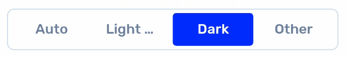

<h1 align="center">
  React Native Button Toggle Group
</h1>
<div align="center">

[](https://www.npmjs.com/package/react-native-button-toggle-group/)

</div>

## Install

```
npm i --save react-native-button-toggle-group
```

Or

```
yarn add react-native-button-toggle-group
```

## Usage




```jsx
import ButtonToggleGroup from 'react-native-button-toggle-group';

// ...

<ButtonToggleGroup
    highlightBackgroundColor={'blue'}
    highlightTextColor={'white'}
    inactiveBackgroundColor={'transparent'}
    inactiveTextColor={'grey'}
    values={['Auto', 'Light', 'Dark']}
    onSelect={val => console.log(val)}
/>
```

## Props

| Property | Type | Description |
| -------- | ---- | ----------- |
|  `values`        | `string[]` | The list of strings to render as options for the button group |
|  `onSelect`        | `(val: string) => void` | A function that's called whenever one of the values is selected |
|  `highlightBackgroundColor`        | `string` | The color that the selected background will be. In the above GIF, it's blue. |
|  `highlightTextColor`        | `string` | The color that the selected text will be. In the above GIF, it's white. |
|  `inactiveBackgroundColor`        | `string` | The color that the inactive background will be. In the above GIF, it's white. |
|  `inactiveTextColor`        | `string` | The color that the inactive text will be. In the above GIF, it's a light blue grey. |
|  `style`        | StyleProp | Overwrite styling that can be applied to the container of the button toggle group. In the above GIF, we've added a border, border radius, and some padding. |
| `textStyle`         | StyleProp | Overwrite styling that can be applied to the text of the button toggle group. In the above GIF, we've changed the font family and font size. |
